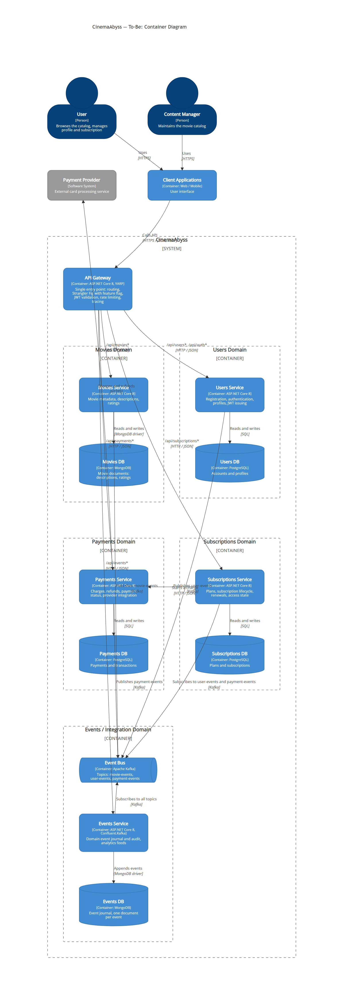
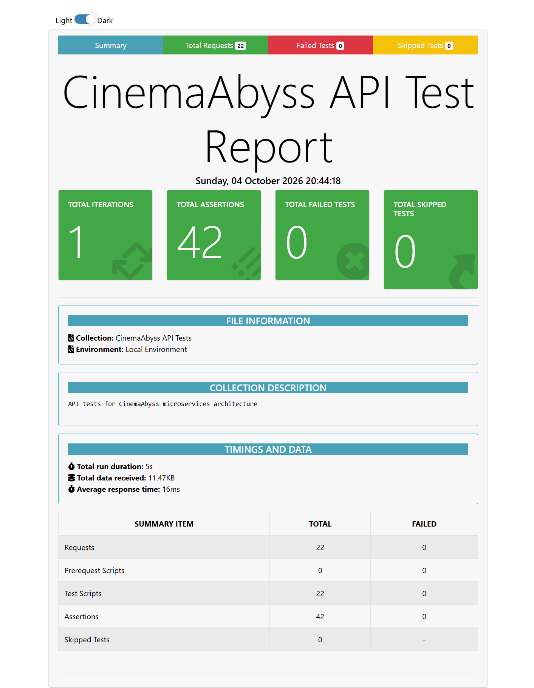
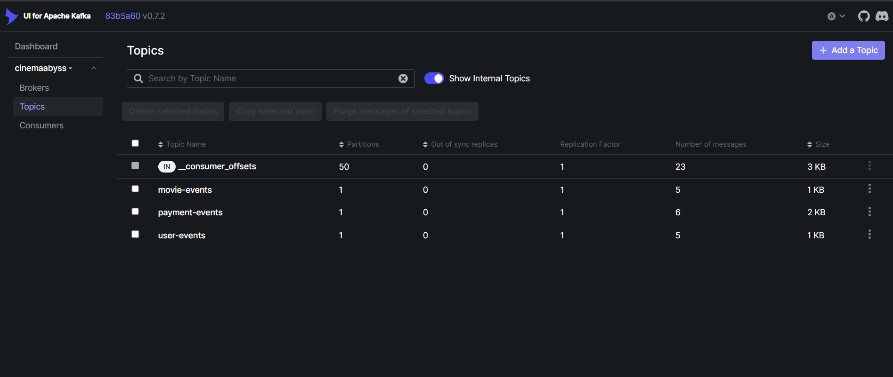
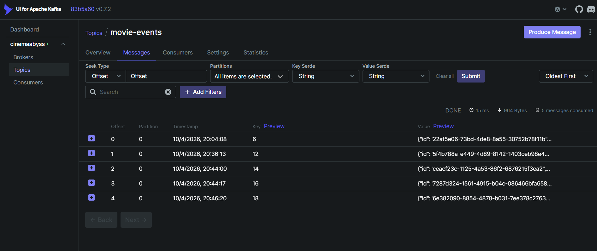
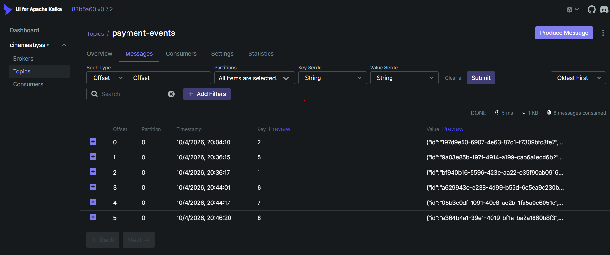
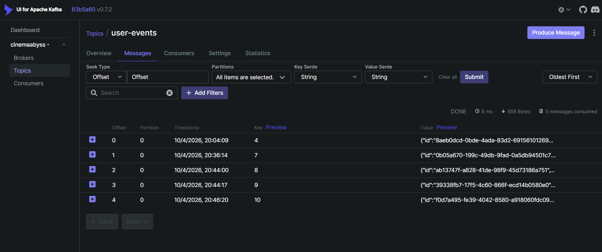

## See the [README.md](.\README.md) file and the project structure.

# Task 1

The to-be architecture of CinemaAbyss is a C4 container diagram that splits the system into five domains:

- **Movies**: Movies Service and Movies DB (MongoDB). Publishes `movie-events`.
- **Users**: Users Service and Users DB (PostgreSQL). Handles registration, authentication and profiles, and issues JWTs. Publishes `user-events`.
- **Payments**: Payments Service and Payments DB (PostgreSQL). Handles charges, refunds and provider integration. Publishes `payment-events`.
- **Subscriptions**: Subscriptions Service and Subscriptions DB (PostgreSQL). Manages plans, the subscription lifecycle and renewals.
- **Events / Integration**: Kafka event bus, Events Service and Events DB (MongoDB). Journals and audits all domain events.

Each domain owns its database, and no service reads another service's data directly. Services integrate in two ways: synchronous REST calls through the API Gateway or a domain's public API, and asynchronous events over Kafka. A subscription purchase needs no distributed transaction: Subscriptions creates the subscription as `pending`, Payments charges the customer and publishes the result, and Subscriptions moves the subscription to `active` or `cancelled` when it consumes that event.

All clients call a single entry point, the **API Gateway**. It routes requests by domain, applies the Strangler Fig feature flag to `/api/movies*`, validates JWTs, rate-limits requests, and provides unified logging and tracing.

Full diagram and details: [container diagram (C4)](docs/architecture/to-be-container-diagram.md)



# Task 2

### 1. Proxy
The proxy (API Gateway) is implemented in C# / ASP.NET Core 8 in `src/microservices/proxy`, following Clean Architecture: `Domain` (routing rules and migration policy), `Application` (the forwarding command handler and its ports), `Infrastructure` (HTTP forwarding, configuration, random roll) and `Api` (endpoints, environment mapping, Dockerfile). Its docker-compose service uses the variables from the task: `MONOLITH_URL`, `MOVIES_SERVICE_URL`, `EVENTS_SERVICE_URL`, `GRADUAL_MIGRATION` and `MOVIES_MIGRATION_PERCENT`.

Routing rules (Strangler Fig):

- `/health` is answered by the gateway itself.
- `/api/movies/health` always goes to movies-service.
- `/api/movies*` is split by the feature flag. With `GRADUAL_MIGRATION=true`, each request draws a random number from 0 to 99, and it goes to movies-service if the number is below `MOVIES_MIGRATION_PERCENT`, otherwise to the monolith. With `GRADUAL_MIGRATION=false`, all movie traffic goes to movies-service.
- `/api/events*` goes to events-service.
- Everything else (`/api/users`, `/api/payments`, `/api/subscriptions`, ...) goes to the monolith.

Results:

- Postman (`npm run test:local`): 22 of 22 requests and 42 of 42 assertions pass, including the Proxy and Events folders.
- Gradual transition: with `MOVIES_MIGRATION_PERCENT=50`, 20 consecutive calls to `/api/movies` were split 9 to movies-service and 11 to the monolith. The proxy's HTTP client logs the upstream URL of each request, so the backend that served it is visible in `docker logs`.
- Unit tests for the routing rules and the forwarding handler: 20 pass.

How to check it:

```bash
docker compose up -d --build
curl http://localhost:8000/api/movies
```

To test the transition, change `MOVIES_MIGRATION_PERCENT` in `docker-compose.yml` (for example to `0` or `100`), then run `docker compose up -d proxy-service` and repeat the calls. In `docker logs cinemaabyss-proxy-service`, each line `Start processing HTTP request GET http://<backend>:<port>/...` shows which backend served the request.

### 2. Kafka
The events service is an MVP that tests how easily Kafka fits into this architecture. It is implemented in C# / ASP.NET Core 8 with Confluent.Kafka in `src/microservices/events`, following the same Clean Architecture layers as the proxy. It is added to docker-compose as `events-service` and talks to the existing Kafka broker.

- **Producer:** `POST /api/events/movie`, `/api/events/user` and `/api/events/payment` validate the request, wrap it in an envelope (`id`, `type`, `timestamp`, `payload`), publish it to `movie-events`, `user-events` or `payment-events`, and return `201` with the partition and offset. Invalid input returns `400` (validation by `[ApiController]`; the Postman tests do not cover this case). Messages are keyed by the movie, user or payment ID. Each topic currently has one partition, so the key does not change ordering yet; it keeps events for the same entity in order once topics have more partitions.
- **Consumer:** a background service in the same process subscribes to all three topics and logs every message it reads in the form `[consumer] topic=... partition=... offset=... key=... value=...`. This is the "produces and consumes" part of the MVP.
- **Health:** `GET /api/events/health` returns `{"status": true}`.

Result: the Postman events tests pass (`Create Movie Event`, `Create User Event`, `Create Payment Event`, each returning `201` with `status: success`). The service log shows each published event being consumed, in the format above.

How to check it:

```bash
docker compose up -d --build
cd tests/postman && npm install && npm run test:local
docker logs cinemaabyss-events-service
```

Screenshots:

- Postman results:

  

- Kafka UI topic state (http://localhost:8090, topics `movie-events`, `user-events`, `payment-events`):

  

  

  

  

# Task 3

The team has started migrating to Kubernetes for better scaling and reliability.
As the architect, the hardest part is left for you:
 - implement CI/CD for building the proxy service
 - implement the configuration files needed to switch traffic


### CI/CD

 In the .github/workflows folder, extend the deployment of the new proxy and events services in docker-build-push.yml, so that the api-tests run correctly when a commit is pushed to your repository.

You need to change
```yaml
on:
  push:
    branches: [ main ]
    paths:
      - 'src/**'
      - '.github/workflows/docker-build-push.yml'
  release:
    types: [published]
```
and add the necessary steps to the block
```yaml
jobs:
  build-and-push:
    runs-on: ubuntu-latest
    permissions:
      contents: read
      packages: write

    steps:
      - name: Checkout repository
        uses: actions/checkout@v3

      - name: Set up Docker Buildx
        uses: docker/setup-buildx-action@v2

      - name: Log in to the Container registry
        uses: docker/login-action@v2
        with:
          registry: ${{ env.REGISTRY }}
          username: ${{ github.actor }}
          password: ${{ secrets.GITHUB_TOKEN }}

```
Once the build finishes and your images appear in the GitHub registry, you can move on to configuring Kubernetes.
A successful result of this step is a "green" build and "green" tests.


### Proxy in Kubernetes

#### Step 1
To deploy to Kubernetes you need to log in to the GitHub docker registry.
1. Create a Personal Access Token (PAT) at https://github.com/settings/tokens . Create a classic token with the read:packages scope.
2. In src/kubernetes/*.yaml (event-service, monolith, movies-service and proxy-service) edit the paths to your images
```bash
 spec:
      containers:
      - name: events-service
        image: ghcr.io/your-login/repository-name/events-service:latest
```
3. In the secret src/kubernetes/dockerconfigsecret.yaml, add to the field
```bash
 .dockerconfigjson: base64 value of the ~/.docker/config.json file
```

4. If ~/.docker/config.json has no authentication value
```json
{
        "auths": {
                "ghcr.io": {
                       empty here
                }
        }
}
```
then run

and add

```json 
 "auth": "username:token in base64"
```

To get the base64 value you can run
```bash
 echo -n your_login:your_token | base64
```

After filling in config.json, also pass its contents through base64

```bash
cat .docker/config.json | base64
```

and put the resulting value into

```bash
 .dockerconfigjson: base64 value of the ~/.docker/config.json file
```

#### Step 2

  Extend src/kubernetes/event-service.yaml and src/kubernetes/proxy-service.yaml

  - Create a Deployment and a Service in each
  - Extend ingress.yaml so that the event-creation tests can be run through it
  - Carry out the next steps to bring up the cluster:

  1. Create the namespace:
  ```bash
  kubectl apply -f src/kubernetes/namespace.yaml
  ```
  2. Create the secrets and configuration:
  ```bash
  kubectl apply -f src/kubernetes/configmap.yaml
  kubectl apply -f src/kubernetes/secret.yaml
  kubectl apply -f src/kubernetes/dockerconfigsecret.yaml
  kubectl apply -f src/kubernetes/postgres-init-configmap.yaml
  ```

  3. Deploy the database:
  ```bash
  kubectl apply -f src/kubernetes/postgres.yaml
  ```

  At this stage, running
  ```bash
  kubectl -n cinemaabyss get pod
  ```
  you should see

  NAME         READY   STATUS    
  postgres-0   1/1     Running   

  4. Deploy Kafka:
  ```bash
  kubectl apply -f src/kubernetes/kafka/kafka.yaml
  ```

  Check that 3 pods are now running. If something is wrong, look at the logs
  ```bash
  kubectl -n cinemaabyss logs pod_name (for example kafka-0)
  ```

  5. Deploy the monolith:
  ```bash
  kubectl apply -f src/kubernetes/monolith.yaml
  ```
  6. Deploy the microservices:
  ```bash
  kubectl apply -f src/kubernetes/movies-service.yaml
  kubectl apply -f src/kubernetes/events-service.yaml
  ```
  7. Deploy the proxy service:
  ```bash
  kubectl apply -f src/kubernetes/proxy-service.yaml
  ```

  After startup and once the pods are up, the output of
  ```bash
  kubectl -n cinemaabyss get pod
  ```

  should look something like this

```bash
  NAME                              READY   STATUS    

  events-service-7587c6dfd5-6whzx   1/1     Running  

  kafka-0                           1/1     Running   

  monolith-8476598495-wmtmw         1/1     Running  

  movies-service-6d5697c584-4qfqs   1/1     Running  

  postgres-0                        1/1     Running  

  proxy-service-577d6c549b-6qfcv    1/1     Running  

  zookeeper-0                       1/1     Running 
```

  8. Add the ingress

  - enable the add-on
  ```bash
  minikube addons enable ingress
  ```
  ```bash
  kubectl apply -f src/kubernetes/ingress.yaml
  ```
  9. Add to /etc/hosts
  127.0.0.1 cinemaabyss.example.com

  10. Run
  ```bash
  minikube tunnel
  ```
  11. Open https://cinemaabyss.example.com/api/movies
  You should see the list of movies.
  You can experiment with the MOVIES_MIGRATION_PERCENT value in src/kubernetes/configmap.yaml and confirm that movies calls go fully to the new service.

  12. Run the tests from the tests/postman folder
  ```bash
   npm run test:kubernetes
  ```
  Some of the health-check tests will fail, but event creation will work.
  Open the event-service logs and take a screenshot of the event processing.

#### Step 3
Add here a screenshot of the output when calling https://cinemaabyss.example.com/api/movies and a screenshot of the event-service output after running the tests.


# Task 4
For easier future updates and deployments, as the architect you also need to implement Helm charts for the proxy service and verify that they work.

To do this:
1. Go to the helm directory and edit the values.yaml file

```yaml
# Proxy service configuration
proxyService:
  enabled: true
  image:
    repository: ghcr.io/db-exp/cinemaabysstest/proxy-service
    tag: latest
    pullPolicy: Always
  replicas: 1
  resources:
    limits:
      cpu: 300m
      memory: 256Mi
    requests:
      cpu: 100m
      memory: 128Mi
  service:
    port: 80
    targetPort: 8000
    type: ClusterIP
```

- Instead of ghcr.io/db-exp/cinemaabysstest/proxy-service, write your own image path for all services
- For imagePullSecret, set your own value (copy it from the Kubernetes configuration)
  ```yaml
  imagePullSecrets:
      dockerconfigjson: ewoJImF1dGhzIjogewoJCSJnaGNyLmlvIjogewoJCQkiYXV0aCI6ICJaR0l0Wlhod09tZG9jRjl2UTJocVZIa3dhMWhKVDIxWmFVZHJOV2hRUW10aFVXbFZSbTVaTjJRMFNYUjRZMWM9IgoJCX0KCX0sCgkiY3JlZHNTdG9yZSI6ICJkZXNrdG9wIiwKCSJjdXJyZW50Q29udGV4dCI6ICJkZXNrdG9wLWxpbnV4IiwKCSJwbHVnaW5zIjogewoJCSIteC1jbGktaGludHMiOiB7CgkJCSJlbmFibGVkIjogInRydWUiCgkJfQoJfSwKCSJmZWF0dXJlcyI6IHsKCQkiaG9va3MiOiAidHJ1ZSIKCX0KfQ==
  ```

2. In the ./templates/services folder, fill in the templates for proxy-service.yaml and events-service.yaml (base them on your Kubernetes configuration - the point of Helm is to have templates for quick updates and installs)

```yaml
template:
    metadata:
      labels:
        app: proxy-service
    spec:
      containers:
       Your configuration here
```

3. Verify the installation
First remove the existing installation manually

```bash
kubectl delete all --all -n cinemaabyss
kubectl delete  namespace cinemaabyss
```
Run
```bash
helm install cinemaabyss .\src\kubernetes\helm --namespace cinemaabyss --create-namespace
```
If you get this error during the process
```code
[2025-04-08 21:43:38,780] ERROR Fatal error during KafkaServer startup. Prepare to shutdown (kafka.server.KafkaServer)
kafka.common.InconsistentClusterIdException: The Cluster ID OkOjGPrdRimp8nkFohYkCw doesn't match stored clusterId Some(sbkcoiSiQV2h_mQpwy05zQ) in meta.properties. The broker is trying to join the wrong cluster. Configured zookeeper.connect may be wrong.
```

Check the deployment:
```bash
kubectl get pods -n cinemaabyss
minikube tunnel
```

Then open
https://cinemaabyss.example.com/api/movies
and attach a screenshot of the Helm deployment and of the output of https://cinemaabyss.example.com/api/movies

## Clean up everything

```bash
kubectl delete all --all -n cinemaabyss
kubectl delete namespace cinemaabyss
```
