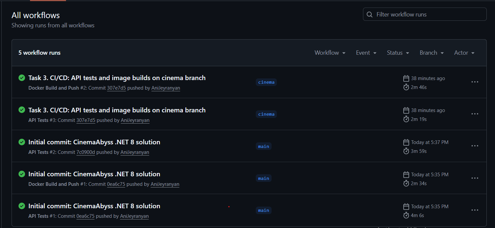
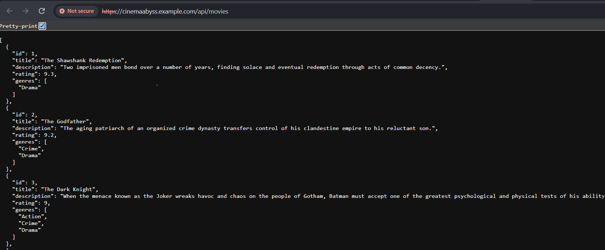
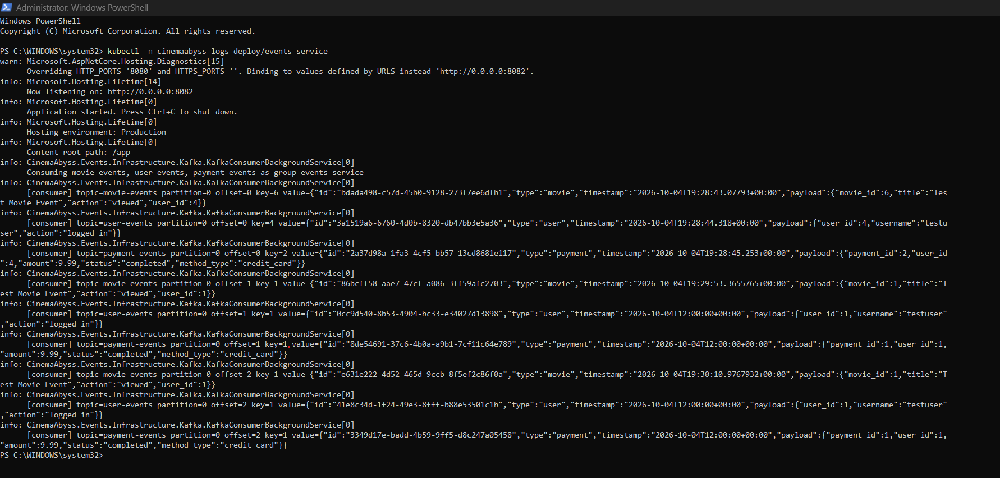
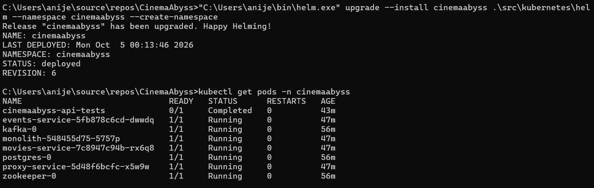

# CinemaAbyss: implementation

# Task 1: To-be architecture

The to-be architecture is a C4 container diagram that splits the system into five domains.

Steps:
1. Read the README and the project structure to identify the existing services and their data.
2. Split the system into domains: Movies, Users, Payments, Subscriptions, and Events / Integration.
3. Give each domain its own service and database: Movies (MongoDB), Users (PostgreSQL), Payments (PostgreSQL), Subscriptions (PostgreSQL), Events (MongoDB).
4. Define the integration: synchronous REST through the API Gateway or a domain's public API, and asynchronous events over Kafka (`movie-events`, `user-events`, `payment-events`).
5. Place a single entry point, the API Gateway, in front of all domains. It routes by domain, applies the Strangler Fig flag to `/api/movies*`, and validates JWTs.
6. Describe the subscription purchase without a distributed transaction: Subscriptions creates the subscription as `pending`, Payments charges and publishes the result, and Subscriptions moves it to `active` or `cancelled`.
7. Write the diagram and its details in [docs/architecture/to-be-container-diagram.md](docs/architecture/to-be-container-diagram.md).


# Task 2: Proxy and Kafka events service

## 1. Proxy (API Gateway)

The proxy is an ASP.NET Core 8 service in `src/microservices/proxy`, structured with Clean Architecture:
- `Domain`: routing rules (`RouteResolver`) and the migration policy (`MigrationPolicy`).
- `Application`: the `ForwardHttpRequestCommand` handler and the interfaces it depends on.
- `Infrastructure`: HTTP forwarding, option binding and the random roll.
- `Api`: the endpoints, environment mapping and Dockerfile.

Steps:
1. Create the four layers and their project references.
2. Implement the routing rules in `RouteResolver`:
   - `/health` is answered by the gateway itself.
   - `/api/movies/health` always goes to movies-service.
   - `/api/movies*` is split by the feature flag. With `GRADUAL_MIGRATION=true`, a random roll from 0 to 99 is compared with `MOVIES_MIGRATION_PERCENT`: below it goes to movies-service, otherwise to the monolith. With `GRADUAL_MIGRATION=false`, all movie traffic goes to movies-service.
   - `/api/events*` goes to events-service.
   - Everything else goes to the monolith.
3. Implement the forwarding command: it copies the method, path, query, headers and body to the chosen backend and returns the upstream status and body. An unreachable backend returns `502`.
4. Read the environment variables from the task (`MONOLITH_URL`, `MOVIES_SERVICE_URL`, `EVENTS_SERVICE_URL`, `GRADUAL_MIGRATION`, `MOVIES_MIGRATION_PERCENT`) through the options classes.
5. Add the Dockerfile and the `proxy-service` entry to `docker-compose.yml`.
6. Add unit tests for the routing rules and the forwarding handler: `tests/CinemaAbyss.Proxy.UnitTests`, 20 tests, all passing.
7. Start the stack and run the Postman suite: `docker compose up -d --build`, then `cd tests/postman && npm run test:local`. All 22 requests and 42 assertions pass, including the Proxy and Events folders.


8. Test the gradual transition: change `MOVIES_MIGRATION_PERCENT` in `docker-compose.yml`, run `docker compose up -d proxy-service`, and call `curl http://localhost:8000/api/movies`. The proxy logs `Start processing HTTP request GET http://<backend>:<port>/...` for each request, so `docker logs cinemaabyss-proxy-service` shows which backend served it.

## 2. Kafka events service

The events service is an MVP that checks how easily Kafka fits into the architecture. It is an ASP.NET Core 8 service with Confluent.Kafka in `src/microservices/events`, using the same layers as the proxy.

Steps:
1. Define the event envelope (`id`, `type`, `timestamp`, `payload`) and the three payloads: movie, user and payment.
2. Implement the producer endpoints `POST /api/events/movie`, `/api/events/user` and `/api/events/payment`. Each validates the request, wraps it in the envelope, publishes it to its topic and returns `201` with the partition and offset. Invalid input returns `400`.
3. Key each message by the movie, user or payment ID.
4. Implement the consumer as a background service in the same process. It subscribes to all three topics and logs each message as `[consumer] topic=... partition=... offset=... key=... value=...`.
5. Create the topics in docker-compose with `KAFKA_CREATE_TOPICS` (`movie-events`, `user-events`, `payment-events`, one partition each) and add the `events-service` entry.
6. Run the Postman events tests (`Create Movie Event`, `Create User Event`, `Create Payment Event`, each returning `201` with `status: success`).
7. Check the result in the Kafka UI at http://localhost:8090 and in the service log with `docker logs cinemaabyss-events-service`.


# Task 3: CI/CD and Kubernetes

## CI/CD

The workflow is `.github/workflows/docker-build-push.yml`.

Steps:
1. Set the triggers: pushes to `main` and `cinema` that change `src/**` or the workflow file, published releases, and manual `workflow_dispatch`.
2. In `build-and-push`, log in to `ghcr.io` with `GITHUB_TOKEN` and build and push the monolith, movies-service, events-service and proxy-service images. Each image gets semver, short SHA, branch and `latest` tags.
3. Add the `deploy-and-test` job, which runs after all images are pushed:
   - start Minikube with the ingress add-on and wait for the ingress controller;
   - build the image pull secret at run time from the GitHub user and `GITHUB_TOKEN`, so no token is stored in the repository;
   - run `helm upgrade --install` on `src/kubernetes/helm`, then `helm test`;
   - run `minikube tunnel`, map `cinemaabyss.example.com` in `/etc/hosts`, and run `npm run test:kubernetes`;
   - upload the Postman reports, and on failure print the pods, events and service logs.
4. The `API Tests` workflow (`api-tests.yml`) runs `docker compose up`, waits for the health endpoints, and runs the Postman suite on each push.

The build for commit `307e7d5` is green for both `Docker Build and Push` and `API Tests`:



## Proxy in Kubernetes

Steps:
1. Create a GitHub classic token with the `read:packages` scope and create the pull secret. The committed `src/kubernetes/dockerconfigsecret.yaml` keeps a placeholder, and the value is supplied locally.
2. Point the images in `src/kubernetes/*.yaml` to `ghcr.io/anijeyranyan/cinemaabyss/<service>:latest`.
3. Write a Deployment and a Service for `events-service` and `proxy-service`. The proxy reads its settings from `app-config`, and it has a readiness probe on `/health`.
4. Route all ingress traffic to `proxy-service`, including `/api/events`, in `src/kubernetes/ingress.yaml`. The Postman event tests then go through the gateway.
5. Apply the manifests in order: namespace, configmap, secret, dockerconfigsecret, postgres-init-configmap, postgres, Kafka (`kafka/kafka.yaml`), monolith, movies-service, events-service, proxy-service.
6. Check the pods with `kubectl -n cinemaabyss get pod`. Postgres, Kafka and ZooKeeper, the monolith, movies, events and proxy all show `Running`.
7. Enable the ingress add-on (`minikube addons enable ingress`), apply `ingress.yaml`, add `127.0.0.1 cinemaabyss.example.com` to `/etc/hosts`, and run `minikube tunnel`.
8. Open https://cinemaabyss.example.com/api/movies to see the list of movies. The `MOVIES_MIGRATION_PERCENT` value in `src/kubernetes/configmap.yaml` controls which backend serves them.
9. Run `npm run test:kubernetes` from `tests/postman`. The health-check tests fail as expected, and event creation passes. Check the event processing in the events-service log.

Screenshots:

Output of `https://cinemaabyss.example.com/api/movies`:



Event-service log after the tests (`kubectl -n cinemaabyss logs deploy/events-service`):



The full log is in `tests/postman/reports/service_logs.txt`.

# Task 4: Helm chart

The chart is in `src/kubernetes/helm` (`Chart.yaml`, `values.yaml`, `templates/`).

Steps:
1. Fill in `values.yaml`:
   - `proxyService` with the image repository `ghcr.io/anijeyranyan/cinemaabyss/proxy-service`, `tag: latest`, `pullPolicy: Always`, one replica, CPU and memory limits, and service port 80 mapped to target port 8000.
   - The same image, port and service blocks for `eventsService`, `monolith` and `moviesService`.
   - A `config` block with the shared non-secret settings (service URLs, `GRADUAL_MIGRATION`, `MOVIES_MIGRATION_PERCENT`).
   - `imagePullSecrets.dockerconfigjson`: the base64 of the Docker config. The committed value is a placeholder, and CI overrides it at install time.
2. Write the templates in `templates/services/`:
   - `proxy-service.yaml` and `events-service.yaml`, plus `monolith.yaml` and `movies-service.yaml`. Each has a Deployment and a Service, and reads its image, port and resources from `values.yaml`.
   - The proxy Deployment gets its routing settings from the `config` block.
3. Add the shared templates: `config.yaml` (ConfigMap), `secrets.yaml` (Postgres credentials, connection string and the pull secret), `ingress.yaml` (routes everything to `proxy-service`), and `infrastructure/postgres.yaml` and `infrastructure/kafka.yaml`.
4. Add a Helm test hook in `templates/tests/api-tests.yaml`. It checks the health endpoints and creates a movie, user and payment event from inside the cluster, and it fails if any call doesn't return the expected status.
5. Install or upgrade the release:
   ```bash
   helm upgrade --install cinemaabyss .\src\kubernetes\helm --namespace cinemaabyss --create-namespace
   ```
   The release reached revision 6 with status `deployed`.
6. Check the pods with `kubectl get pods -n cinemaabyss`. All services are `Running`, and the `cinemaabyss-api-tests` pod is `Completed`.
7. Open https://cinemaabyss.example.com/api/movies through `minikube tunnel` and check the movie list.

Screenshots:

Helm deployment and pod status:



Output of https://cinemaabyss.example.com/api/movies:


