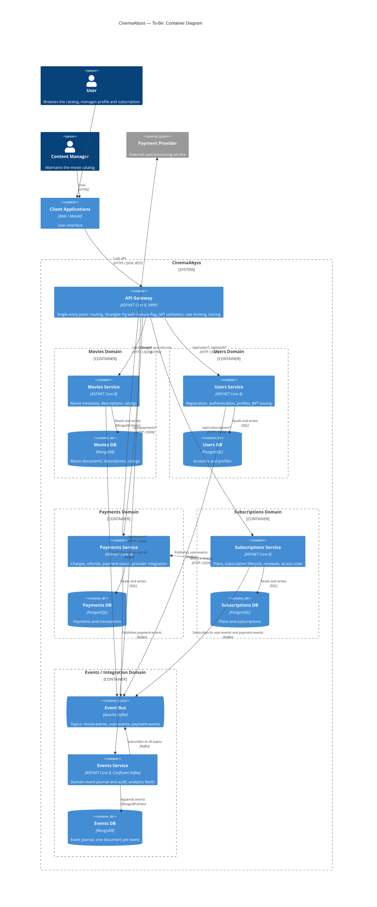

# CinemaAbyss — To-Be Architecture (C4 Container Diagram)

## Diagram

## Domains

| Domain | Containers | Store | Responsibility | Owns data | Publishes events |
|---|---|---|---|---|---|
| Movies | Movies Service, Movies DB | MongoDB | Movie catalog, descriptions, ratings | Yes (movie documents) | `movie-events` |
| Users | Users Service, Users DB | PostgreSQL | Registration, authentication, profiles | Yes (`users`) | `user-events` |
| Payments | Payments Service, Payments DB | PostgreSQL | Charges, refunds, payment status, provider integration | Yes (`payments`) | `payment-events` |
| Subscriptions | Subscriptions Service, Subscriptions DB | PostgreSQL | Plans, subscription lifecycle, renewals, access state | Yes (`subscriptions`, `plans`) | — |
| Events / Integration | Event Bus (Kafka), Events Service, Events DB | MongoDB | Event bus, journal, audit, analytics | Event journal | — |

Rule: each domain owns its database and never reads another domain's data directly. Shared data is exchanged through APIs or events.

## Data Stores

| Service | Store | Why |
|---|---|---|
| Movies | MongoDB | Descriptions and ratings are read-heavy and change shape over time (new fields, nested ratings). Documents return a whole movie in one read. |
| Events | MongoDB | The journal is append-only, and each event type has a different payload. A document per event avoids a table per event type. |
| Users | PostgreSQL | Needs unique constraints (emails, logins) and transactional updates. |
| Payments | PostgreSQL | Financial records need ACID transactions, strict constraints, and an audit trail. |
| Subscriptions | PostgreSQL | State transitions (pending → active → suspended → cancelled) must be consistent, and reports join across plans and subscriptions. |

Each service has its own database. No service connects to another service's database.

## Single Entry Point

All clients call only the **API Gateway**. It:

- routes requests by domain (`/api/movies*` → Movies, `/api/users*` → Users, `/api/payments*` → Payments, `/api/subscriptions*` → Subscriptions, `/api/events*` → Events);
- implements Strangler Fig: for `/api/movies*` it picks the backend by feature flag and migration percentage (as `Proxy__MoviesMigrationPercent` does today);
- validates the JWT issued by the Users Service before forwarding the request to a domain;
- applies rate limiting and provides unified logging and tracing.

Clients have no direct access to domain services; they are reachable only inside the cluster network.

## Integration

| Type | Example | Mechanism |
|---|---|---|
| Client → domain | Catalog request | Synchronous REST through the API Gateway |
| Domain → domain (request/response) | Subscriptions starts a charge | Synchronous REST, only through the other domain's public API |
| Domain → domain (event) | Payments reports a charge result; Subscriptions activates or suspends accordingly | Asynchronous via Kafka (`payment-events`) |
| Domain → domain (event) | Subscriptions updates its local user reference | Asynchronous via Kafka (`user-events`) |
| Journaling | All domain events | Events Service subscribes to all topics |

### Subscription purchase flow (no distributed transaction)

1. Client calls `POST /api/subscriptions`. Subscriptions creates the subscription with status `pending`.
2. Subscriptions calls Payments (`POST /api/payments`) to start the charge.
3. Payments calls the provider, stores the result, and publishes `payment-events` (`succeeded` or `failed`).
4. Subscriptions consumes the event and moves the subscription to `active` or `cancelled`.

Renewals work the same way: a failed renewal payment moves the subscription to `suspended` through an event.

Event schema: `EventEnvelope` (already implemented in `src/microservices/events/CinemaAbyss.Events.Domain`). Domains publish events through the Transactional Outbox pattern, so an event is not lost if the process fails between the database write and the Kafka send.

## Migration from the Current System (Strangler Fig)

1. Today the `monolith` serves all domains in PostgreSQL, `movies-service` has been extracted from it (sharing the PostgreSQL database), and `events-service` is an MVP.
2. Movies moves to MongoDB. The Gateway shifts `/api/movies*` from the monolith to the Movies Service with the feature flag. Data is copied from PostgreSQL to MongoDB and kept in sync until the switch is complete.
3. Payments and Subscriptions are extracted from the monolith one at a time: a new service, a Gateway route, a data migration, then the monolith route is removed. Payments goes first, because Subscriptions depends on it.
4. Users is extracted the same way.
5. Once all routes point to new services, the monolith is decommissioned.

## Notes

- The diagram is written in Mermaid (`C4Container`). GitHub renders it when the file is viewed; it can also be pasted into any Mermaid editor.
- Payments, Subscriptions, and Users are not separate services in the current code; those domains live inside `monolith`. They are described here as the target state.
- JWT authentication is described as the target state; the current code does not implement it.
- The Events DB in MongoDB is a suggestion. Relational storage would also work if the team prefers one database type.
